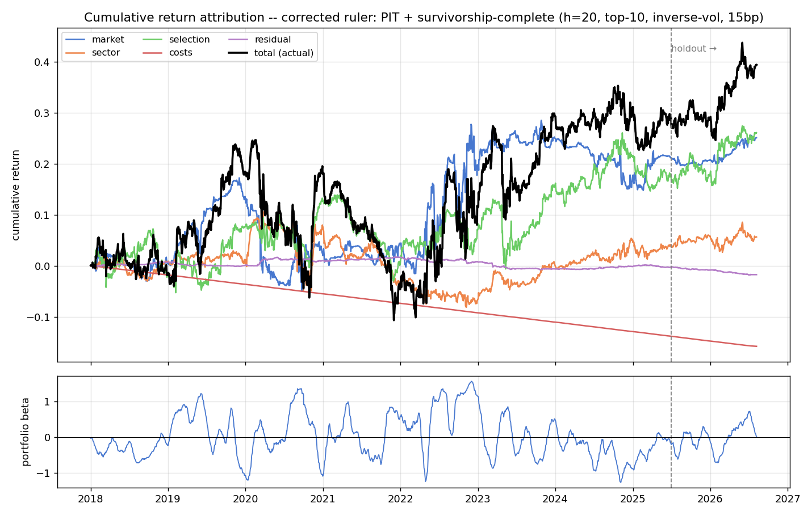
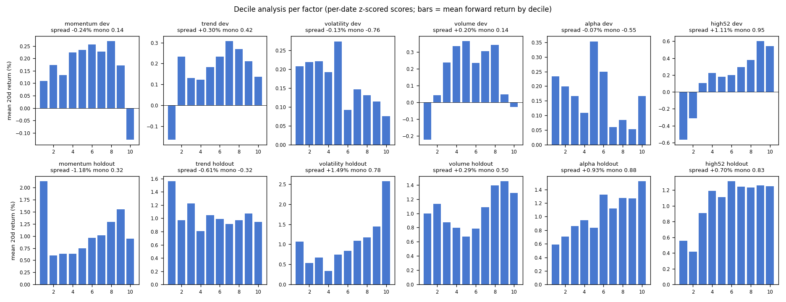

# Honest Alpha: Auditing, Rebuilding, and Stress-Testing a Multi-Factor Equity System

*Research report — August 2026. All numbers in this report are reproducible from the committed evaluation code (`research/evaluation/`) and are recorded with the exact commits that produced them.*

---

## Executive summary

This project began as a multi-factor US-equity paper-trading system that reported a backtest Sharpe of 1.89 and a 63.4% win rate. **Both numbers were false.** A line-by-line audit found a single feature reading prices eleven days into the future, a backtest that had never actually used its models' predictions, and an execution path that bought the stocks the model wanted to short.

Rather than patch and move on, I rebuilt the entire evaluation methodology — purged walk-forward validation, per-date cross-sectional rank IC with Newey-West inference, a four-tier evidence framework with an untouched holdout, pre-registered adoption rules, and a hypothesis ledger that applies family-wise multiple-testing corrections to every claim the project has ever made.

The rebuilt ruler then adjudicated **21 hypotheses: 3 adoptions, 17 rejections, 1 watch-list item**. Two of the rejections overturned findings that had looked statistically significant (t > 2) on partial evidence — caught by deliberately mining *never-before-evaluated* data rather than waiting for the future to arrive. The system now trades live (paper) as a fully automated 7-factor book whose honest expectation — on a ruler corrected twice more in August 2026, for point-in-time membership *inside the portfolio* and for survivorship-complete prices of every departed S&P member (§3.7) — is an all-period Sharpe of roughly **0.3** (holdout ≈ 0.85), with a measured stock-selection component of about +3%/yr (§3.6). This report's earlier headline of 0.8 is retracted in §3.7, with the arithmetic. A small number I can defend line by line, which the fake 1.89 never was.

The thesis of this report: **for a research career, the ability to produce a trustworthy zero matters more than the ability to produce an untrustworthy two.**

---

## 1. The audit: three ways to fool yourself

### 1.1 A feature that read the future

The momentum factor included a Detrended Price Oscillator implemented as:

```python
dpo_values = group[column].shift(-shift_period) - sma_values   # shift(-11)
```

`shift(-11)` injects the closing price from **eleven trading days in the future** into a live feature (the textbook DPO uses a *positive* shift). Retraining on identical data with only this fix applied:

| Factor | Horizon | IC with leak | IC after fix |
|---|---|---|---|
| momentum | 1d | +0.2586 | **+0.0199** |
| momentum | 5d | +0.5813 | **+0.0145** |
| momentum | 20d | +0.6452 | **+0.0666** |
| all other factors | all | — | *bit-for-bit unchanged* |

The five factors that did not contain the leaky feature reproduced to the last decimal — a natural control group proving the pipeline is deterministic and the collapse is entirely attributable to the fix. **Roughly 90% of the flagship factor's reported edge was one look-ahead bug.**

### 1.2 A backtest that never consulted the model

```python
for model, weight in zip(models, weights):   # models is a DICT
    pred = model.predict(X)                  # 'xgb'.predict -> AttributeError
    ...
except Exception:
    continue                                 # silently swallowed
```

Iterating two dicts with `zip` yields their *keys*; the string `'xgb'` has no `.predict`; the bare `except` swallowed the error every day. Every prediction stayed zero and the backtest traded an arbitrary fixed basket for its entire history. The Sharpe-1.89 equity curve measured nothing.

### 1.3 An execution path that inverted the signal

The order loop placed `'buy'` unconditionally — SELL signals (about half of all signals) were *bought*, with a dead position-size cap. Independently, the advertised 63.4% win rate was computed on the most recent 500 rows *the models had been trained on*.

**Lesson encoded into the project:** every performance number must come from one audited evaluation path; `tests/` now contains leakage guards that structurally forbid negative feature shifts and backward-fills, so these bug classes cannot silently return.

---

## 2. The rebuilt ruler

### 2.1 Purged walk-forward

Rolling 3-year train / 1-quarter test folds. Between every train window and its test window, `horizon + 5` trading days are purged so no training label overlaps evaluation data; the same purge splits each fold's inner validation, which alone determines model and factor weights. Non-overlapping test windows concatenate into a fully out-of-sample prediction panel (~2,100 trading days, 2017–2026). An optional partial tail fold lets the newest data enter evaluation as its labels mature.

### 2.2 Per-date rank IC with honest inference

The old pipeline scored factors with pooled Pearson correlation over all validation rows — a statistic inflated by time-series co-movement and, for multi-day labels, by overlapping-window autocorrelation (the mechanism behind the leak-era "IC rises with horizon" illusion). The honest question for a cross-sectional book is: *on each day, how well do predictions rank that day's returns?* We compute per-date Spearman IC and report Newey-West t-statistics with `h−1` lags, since consecutive daily ICs at an h-day horizon share overlapping return windows. The naive t overstates significance by roughly √h.

### 2.3 Four evidence tiers

Every experiment reports the same four segments:

| Tier | Period | Role |
|---|---|---|
| `virgin_early` | 2016 – 2021 | data no experiment had ever evaluated (obtained by *extending history backward*) |
| `seen_dev` | 2022 – 2025 H1 | development data — the only segment adoption decisions may optimize |
| `holdout` | 2025-07 – 2026-05 | looked at only for confirmation, never selection |
| `fresh` | after 2026-05 | genuinely new data that did not exist when hypotheses were formed |

The backward extension matters: when a candidate factor looked adoptable on holdout evidence, we did not wait months for new data — we mined the *past* for data the factor had never seen. This adjudicated two would-be adoptions in an afternoon (§4).

### 2.4 The hypothesis ledger

`evaluation/results/hypothesis_ledger.csv` records **every hypothesis this project has ever adjudicated** — including all failures. Each new verdict prints the family size N and the Šidák-corrected t threshold for a 5% family-wise error rate (currently |t| ≥ 2.97 at N = 20). Testing 16 worthless ideas gives a 56% chance that at least one shows t > 2 by luck; the ledger is what makes that arithmetic impossible to forget. It caught a t = 7.5 mirage (a seasonality factor whose "significance" was one hot calendar month spanning ~2 independent observations) and forced honest labeling of a t = 2.88 near-miss (§5).

---

## 3. What the honest ruler measured

### 3.1 Baseline: the signal was worth nothing at daily frequency

At the original 1-day horizon, the blended out-of-sample rank IC is **+0.0025 (t = 0.57)** over 1,071 days — statistically zero. Simulated with the then-assumed 30 bp round-trip cost and next-open execution, the 1-day book loses at a Sharpe of −4.05: pure cost drag on a no-edge signal ((1−0.003)²⁵² ≈ −53%/yr). The reported 63.4% win rate is unreachable from these numbers; it was an in-sample artifact.

### 3.2 Horizon: signal quality and cost amortization both favor longer holds

| Label horizon | Blended rank IC (NW t) | Matched-hold simulation |
|---|---|---|
| 1 day | +0.0025 (0.57) | Sharpe −4.05 |
| 5 days | +0.0094 (1.48) | Sharpe −0.85 |
| 20 days | +0.0071 (0.52) | **Sharpe +0.04 (breakeven)** |

First honestly significant components: **trend@5d (+0.0108, t = 2.27)** and **volatility@5d (+0.0177, t = 2.06)**, volatility being positive in every tier at every horizon. The leak-era conclusion "longer horizons are better" was directionally right for the wrong reasons: honest ICs are ~40× smaller than the leaked ones, and the horizon's true benefit is cost amortization (30 bp over 20 days ≈ 1.5 bp/day), not IC growth.

### 3.3 Execution: measured, not assumed

Three weeks of live paper fills (27+ orders) calibrated the cost model: intraday market orders paid a *median +3.8 bp* versus the submission quote; overnight-queued orders were *unbiased* versus the next official open (mean −2.5 bp, median +6.6 bp, high per-name variance from paper's first-quote fills). With zero commission, the realistic round trip is **12–15 bp, half the modeled 30 bp** — this measurement alone moved the 20-day book's honest expectation from ~0 to dev Sharpe ~0.7. Caveat recorded with the data: paper fills simulate NBBO without market impact and are a lower bound on live costs. A randomized **limit-vs-market execution A/B** (deterministic per-order assignment, monitor-driven timeout-to-market) is accumulating live evidence.

### 3.4 Portfolio construction: one upgrade, one honest discovery, one rejected optimizer

A 12-configuration grid (width × weighting × neutrality × cost) found exactly one robust improvement: **inverse-volatility position sizing** (holdout Sharpe 0.74/0.67/0.63 across widths versus 0.43/0.42/0.37 signal-weighted, with shallower drawdowns) — adopted into production. The grid also surfaced an uncomfortable truth: dollar-neutralizing hurts every configuration, meaning the book's returns carry a **real beta component**; the pure alpha is thinner than the headline. This is reported, not hidden — and §3.6 puts a number on it.

A cvxpy mean-variance optimizer (Ledoit-Wolf covariance, 10% vol target, |β| ≤ 0.5, transaction costs in the objective) **lost to the heuristic** (dev Sharpe 0.44 vs 0.75): horizon-amortized decision costs produced 21.7%/day turnover against a 20-day signal (~8%/yr cost drag), and the beta cap removed drift the incumbent keeps. Two implementation lessons are documented — the myopic-objective zero-trade equilibrium, and a DCP violation in a relative beta bound. *A carefully calibrated heuristic beats an uncalibrated optimizer* is itself a result.

### 3.5 The universe was quietly lying about the past

Point-in-time S&P 500 membership (reconstructed from the index change log; 500–504 members at every checkpoint) measured the membership look-ahead bias directly: **pre-2022 IC was ~85% inclusion-runup artifact** (virgin-tier IC 0.0092 → 0.0014 under PIT filtering), while 2022+ results — where every adoption decision actually lived — were untouched, and every prior rejection survives *a fortiori*. A bonus finding was adopted into production: excluding ETFs/never-members from signal selection doubles dev IC (0.0066 → 0.0129) and lifts holdout IC to 0.051 (t = 2.65) — baskets dilute a rankable cross-section. Documented residual at the time: delisted members' price histories were unavailable with free data, so only the inclusion half of survivorship bias was fixed — and, as §3.7 shows, this experiment compared *signals* and missed what the *portfolio* was doing. Both gaps were closed in August 2026.

### 3.6 Risk model and daily attribution: the beta, named

The "carries beta" caveat deserved a number, so the book got a **two-layer linear risk model** (rolling 252-day SPY beta, estimated ex-ante — the beta attributing day *t* uses data through *t−1* — plus 11 equal-weight sector factors built from market residuals) and a daily attribution that decomposes every session's return into market, sector, stock-selection, cost, and execution-timing components. The decomposition is exact by construction (market + sector + selection ≡ Σ w·r, pinned by unit tests), and the residual is reported separately rather than flattering the selection line.

The verdict on the production book measured on the corrected ruler of §3.7 (h=20, point-in-time members plus every departed member, inverse-vol, calibrated costs — annualized +4.6%):

| Component | dev | holdout | all | IR (all) |
|---|---|---|---|---|
| Market (avg β ≈ 0.0) | +2.8% | +3.6% | **+2.9%** | 0.26 |
| Sector tilts | +0.6% | +1.4% | **+0.7%** | 0.10 |
| **Stock selection** | +2.4% | +7.4% | **+3.0%** | 0.30 |
| Costs | −1.8% | −1.8% | −1.8% | — |
| Execution residual | −0.0% | −1.3% | −0.2% | — |



The same decomposition on the pre-correction panel read market +8.7%, sector +2.9%, selection +4.5% of +13.7%: the two corrections of §3.7 removed almost the entire systematic component — that was look-ahead and survivorship, not beta harvested by design — while the stock-selection component gave up a third and stayed *positive in both evaluation segments* (IR 0.23 dev, 0.89 holdout). Small, real, and now measured on a ruler that includes the dead. The same engine attributes the live paper book every night (`log_attribution.py` → `trading_logs/attribution_history.csv`), accumulating the live answer to the same question.

The risk model's first downstream consumer was pre-registered and **rejected**: a volatility-target overlay (12% target, factor-covariance forecast, scale-*down*-only with a hard 1.0 cap applied to each day's new tranche) delivered exactly what it promised on risk — dev vol 17.0% → 14.5%, max drawdown −23.0% → −21.3% — but charged more Sharpe than the pre-registered band allowed (dev 0.75 → 0.63 against a 0.05 tolerance; holdout confirmed the damage, 1.39 → 1.26). The mechanism is recorded with the verdict: a long-biased book earns much of its return in high-volatility recoveries, and a vol-timing rule sells precisely those days. The overlay stays out of production; the forecaster stays as a monitoring instrument.

### 3.7 The ruler, corrected twice: the retraction of 0.8

Buying survivorship-complete prices (Sharadar SEP, $39/month) to close the residual of §3.5 produced two corrections, one of them unexpected. The experiment was pre-registered as a measurement change, not a hypothesis: whatever the numbers did, a universe that includes the dead becomes the standard.

**Correction 1 — membership look-ahead inside the portfolio.** The August 10 experiment compared *signals* under the point-in-time mask and found the 2022+ IC untouched, so the headline book kept the today's-members panel. But a concentrated top-10 book is not a cross-sectional IC: in 2018–2021 it was buying names that were later *added* to the index, riding their pre-inclusion run-ups. Re-simulating the identical construction under the point-in-time mask:

| Panel | dev Sharpe | holdout | all | ann. (all) |
|---|---|---|---|---|
| today's members, no PIT mask (the 0.8 headline) | 0.76 | 1.38 | **0.83** | +13.4% |
| PIT mask (panel of Aug 10) | 0.35 | 1.62 | 0.51 | +6.8% |
| PIT mask, today's code | 0.33 | 1.13 | 0.44 | +6.7% |
| **PIT mask + survivorship-complete** | **0.22** | **0.85** | **0.27** | **+3.2%** |

**Correction 2 — the dead.** Sharadar keeps a delisted company under its last ticker (SIVB → SIVBQ, FRC → FRCB) and lists the S&P-era code only in a `relatedtickers` field, so departed members are resolved through that field, restricted to common stock that still traded inside the evaluation window. Coverage: **261 of 261** members that left the index in 2014+. Adding them and rerunning the same walk-forward under the same mask lowered blended IC by 30% in dev (0.0267 → 0.0187) and 27% in holdout (0.0520 → 0.0377), and the book's all-period Sharpe from 0.44 to 0.27.

The first verdict re-adjudicated on the corrected ruler was the construction grid of §3.4, and it turned into a second lesson. Dollar-neutralisation *reverses*: it no longer hurts (its old harm was the look-ahead drift being removed) and cuts dev drawdown from −32% to −18%, though its Sharpe gain is not robust across widths and a 50/50 book is not deployable under the 25% short cap of the no-debt principle. The deployable 75/25 "capped-neutral" variant looked like the clear winner on Sharpe (dev 0.42 / holdout 1.45 versus 0.22 / 0.85) — and the risk model rejected it: its market component is +8.7%/yr at β = 0.46 while the selection component *falls* from +3.0% to +1.2%/yr (IR 0.30 → 0.13). Capping the short side removes half the stock-picking and replaces it with market drift — the retracted headline's error, re-entering through the construction door. Production stays on raw top-10 inverse-vol, which on this ruler is already near-neutral (β ≈ 0) and keeps the whole selection component. Rule adopted from this: **no construction verdict without its attribution alongside the Sharpe.**

The obvious breadth lever failed on the same ruler. Sharadar also supplies the 233 current S&P members the free panel never had; adding them (268 → 501 names, same walk-forward, same mask) cut dev IC from 0.0187 to 0.0049 and dev Sharpe roughly in half (n=10: 0.22 → 0.14; n=30: 0.31 → 0.09) — the models do not rank the added mid-caps, and breadth without a rankable signal dilutes. Rejected by the dev-decides rule; holdout *improved* in that single window (0.85 → 1.58) and is logged for the November review rather than acted on.

Two-thirds of the number I had been defending was look-ahead and survivorship. Every verdict adjudicated before 2026-08-25 — the construction grid, the optimizer, the overlay, the factor adoptions — was reached on the pre-correction panel; their *directions* are expected to survive (the corrections act on the universe, not on any one factor) but their magnitudes are not re-certified until rerun. The incident that surfaced along the way is recorded too: on 2026-08-16 Wikipedia moved the index change log to a separate article, the scraper silently read a navigation box in its place, and the weekly refresh overwrote the membership table with a degenerate one (every member since 1957, zero removals). It was caught only because a survivorship fetch with zero departed members is a contradiction; the parser now refuses to write a table that fails three plausibility checks.

### 3.8 Factor report card: what IC alone does not say

A reviewer's list of what the pipeline lacked — orthogonality, decile structure, turnover, a hard gate — became `evaluation/factor_card.py`, run on the corrected ruler (dev 2022–2025 H1 / holdout):

| Factor | IC dev / hold | residual IC dev / hold | decile spread dev (20d) | monotonicity | turnover per hold | spread net of costs |
|---|---|---|---|---|---|---|
| **high52** | **+0.032** / +0.022 | +0.011 / +0.017 | **+1.11%** | **0.95** | 0.80 | **+0.87%** |
| volatility | −0.006 / **+0.051** | −0.003 / +0.037 | −0.13% | −0.76 | 0.84 | −0.38% |
| trend | +0.007 / −0.018 | +0.005 / −0.002 | +0.30% | 0.42 | 0.84 | +0.05% |
| alpha | −0.010 / +0.028 | −0.005 / +0.015 | −0.07% | −0.55 | 0.70 | −0.28% |
| momentum | −0.004 / −0.002 | +0.006 / −0.004 | −0.24% | 0.14 | 0.69 | −0.44% |
| volume | +0.001 / +0.015 | +0.001 / +0.003 | +0.20% | 0.14 | 0.76 | −0.03% |



Three readings. Orthogonality is not the problem: pairwise correlations of the per-date z-scored factor scores never exceed 0.20, and high52's residual IC — after cross-sectional regression on every other factor — is still positive in both segments, so it carries information the rest of the blend does not. Concentration is: on this ruler the book rests on high52, the only factor with a positive dev IC, monotonic deciles and a spread that survives costs; the top-weighted volatility factor (28.8% of the blend) is dev-negative with *inverted* deciles and owes its weight to a strong holdout — the weighting scheme rewards a recent run, which is exactly what the November review must adjudicate. And turnover is the silent tax: 70–84% of the top decile changes every 20-day hold, so at 15 bp round trip most decile spreads are consumed before they reach the book. Every factor fails the family-wise gate at |t| ≥ 3.02 (N = 20); how that gate should treat literature-backed factors versus data-mined ones is the open rulebook question of §6.

---

## 4. The factor program: 21 hypotheses, 3 survivors

The complete ledger, most instructive cases first:

**PEAD (earnings drift) — rejected by the deciding vote it pre-registered.** Built from 25.8k earnings announcements (surprise, reaction, decay features; announcement info usable only from the second session after the date). On July 30 it showed *two independently significant tiers* (virgin +0.0168, t = 2.05; holdout +0.0430, t = 2.24) — adoption-worthy at first glance. Under the pre-registered rule "the fresh tier casts the deciding vote," 40 more days of virgin data returned **−0.0239 (t = −2.77)**: a sign-oscillating factor, not a stable edge. The snapshot that looked adoptable would have put a decaying factor into production.

**vol_ext (8 range/idiosyncratic volatility features) — rejected by mined history.** Dev-neutral, holdout-strong (t = 2.5). Extending the dataset from 2018 back to 2014 created four years of folds the factor had never seen: its virgin IC was *negative* (−0.0077). The entire edge lived in one 10-month window.

**high52 (52-week-high anchoring, George & Hwang 2004) — conditionally adopted.** The strongest profile of any candidate: standalone IC positive in dev (+0.020), holdout (+0.032, t = 2.62) and fresh (+0.066), flat in virgin; blend dev IC **0.0129 → 0.0314**, the largest dev gain of any tested change. Its holdout t = 2.88 sits *below* the Šidák family bar of 2.93 — so adoption is explicitly conditional, with a pre-registered removal trigger (negative fresh tier at the November 2026 review). In the retrained 7-factor production blend it independently earned a 22.9% weight, second only to volatility.

**News tone (GDELT, 262 symbols, 2017+) — validated at 5 days, correctly not deployed at 20.** Passed all three pre-registered conditions at h=5 (sign-positive in three tiers including both virgin ones) but its IC is flat zero at the 20-day production horizon — news information decays. It sits on the shelf, validated, for any future 5-day book.

**Label engineering — three rejections with one architectural lesson.** De-marketed labels were redundant (per-date z-scoring already neutralizes the market component at prediction time); trailing-beta labels added estimation noise; vol-scaled labels double-counted an adjustment the portfolio layer already applies. *Risk and market neutralization should each live in exactly one layer.*

**Fundamentals (SEC EDGAR XBRL) — infrastructure permanent, factors mortal.** A point-in-time pipeline where every value carries its first *filing* date (the day the market learned it), TTM aggregates require all four quarters filed, Q4 flows derived as FY − 3Q, YTD cashflow cumulatives differenced into quarters, tag-switch histories unioned. Verdicts: value dead at 20 days (as pre-discounted), profitability flat everywhere, investment vetoed by a significantly negative fresh tier (t = −3.28) — and **accruals (Sloan 1996) the closest miss in the project** (fresh t = 2.86 vs bar 2.97, no negative tier): watch-listed for the November review. Meta-result: free fundamentals add nothing to a price-based blend at 20 days under these bars.

Also rejected: Amihud illiquidity and short-term reversal (sign oscillators), calendar seasonality (the t = 7.5 mirage), and the leak-era conclusions themselves.

---

## 5. The live system

Fully automated since 2026-07-21: nightly signal generation and staggered order placement (Mon–Fri 21:00 UK), 5-minute intraday risk monitoring, Sunday full retrain, desktop failure alerts. The book: **7 factors** (volatility 28.8%, high52 22.9%, trend 18.8%, alpha 16.9%, momentum 12.6%, market and volume honestly zero-weighted), 273 point-in-time S&P members, 20-day staggered tranches, inverse-volatility sizing, **broker-side GTC bracket orders** (positions protected overnight and across process crashes), registry-broker reconciliation on every cycle (bracket fires are detected and absorbed automatically — validated live twice in the first fortnight).

Factor health has three detection layers. The weekly retrain re-weights factors by recent rank IC and zeroes negatives (automatic, coarse); pre-registered removal triggers fire on fixed dates (strict, infrequent); and a **weekly IC-decay monitor** (`evaluation/ic_monitor.py`) fills the gap between them — each production factor's rolling 120-session rank IC, stitched from the walk-forward history and nightly full-universe score dumps, is compared with its own development-period band, with pre-registered rules (WARN: below dev mean − 1 sd for ≥ 20 sessions; ALERT: below zero for ≥ 60 sessions while carrying weight) that raise a desktop alert and open a removal review — never an automatic removal.

Honest expectation for this configuration on the corrected ruler (§3.7): **all-period Sharpe ≈ 0.3** (dev 0.22, holdout 0.85), of which stock selection is ≈ +3%/yr of the +4.6% total with average β ≈ 0 (§3.6). The 0.8 this report once carried is retracted. Live trading is unaffected by either correction — the book only ever trades current members and cannot look ahead — but its expectation was overstated. Two weeks of live operation surfaced and fixed real bugs (a OneDrive file-lock crash that silently killed one nightly run — now retried with backoff and alerting; an encoding crash in a logging path), exactly what paper trading is for.

## 6. Limitations, stated plainly

1. **Survivorship — fixed 2026-08** (Sharadar histories for 261/261 members departed since 2014); the fix cost ~30% of measured IC and, together with point-in-time masking of the portfolio, revised the headline from 0.8 to ~0.3 (§3.7). Verdicts dated before 2026-08-25 were reached on the pre-correction panel and are not re-certified in magnitude.
2. **Paper fills are a lower bound on costs**; live slippage will be worse than the calibrated 12–15 bp.
3. **Beta and selection are measured, not asserted**: on the corrected ruler the book runs near β ≈ 0 with a stock-selection component of ~+3%/yr (IR 0.3 all-period, 0.9 holdout) — small, positive in both segments, and the only part of the original headline that survived the corrections.
4. **Market-feature reproducibility — fixed 2026-08.** Nightly rebuilds used to refetch macro series live; Yahoo re-adjusts the whole price history on every dividend, so historical feature values drifted between runs (observed: a virgin-tier IC moving 0.0168 → 0.0141 with no code change). Macro series now come from a frozen, append-only snapshot committed to git (`data/market_snapshot.py`; raw closes + dividends + splits, total-return index derived deterministically, only closed sessions ever stored). Any deliberate refresh is a reviewable diff, not silent drift.
5. **Capacity is small** — the strategy trades large-cap US equities in tiny size; measured costs do not extrapolate.
6. **Twenty-one hypotheses is a small family** by industry standards; the ~14% adoption rate and every threshold are computed over exactly the tests recorded, no more, no fewer.

## 7. What I would tell a younger version of this project

- The most valuable line of code in the repo is the purge gap; the most valuable file is the ledger of failures.
- Never let a metric with selection pressure on it (holdout, family threshold) be touched twice.
- When a result looks adoptable, first go find data it has never seen — the past is a cheaper source of virgin data than the future.
- Costs are a hypothesis; fills are data.
- A heuristic you understand beats an optimizer you don't.

*Repository layout, reproduction commands, and per-experiment verdict files are indexed in the README. Every number above traces to a commit.*
